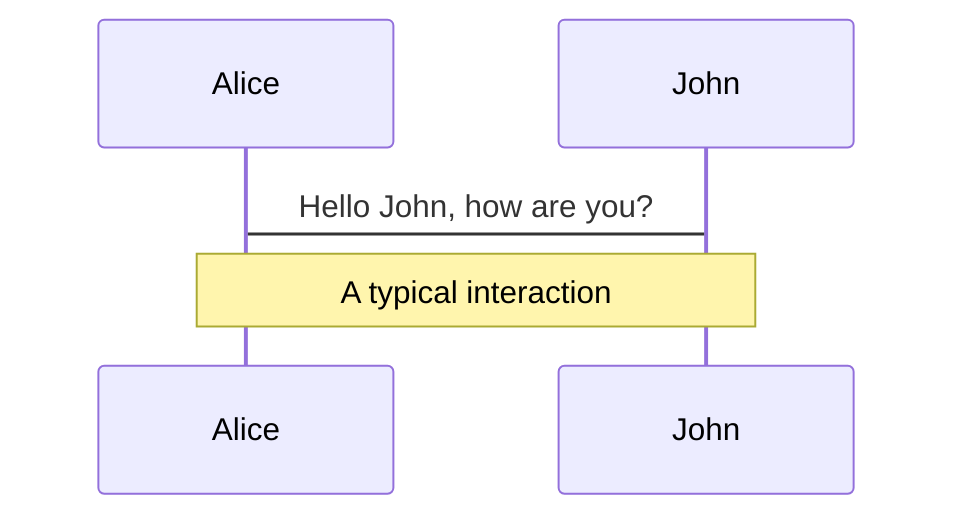
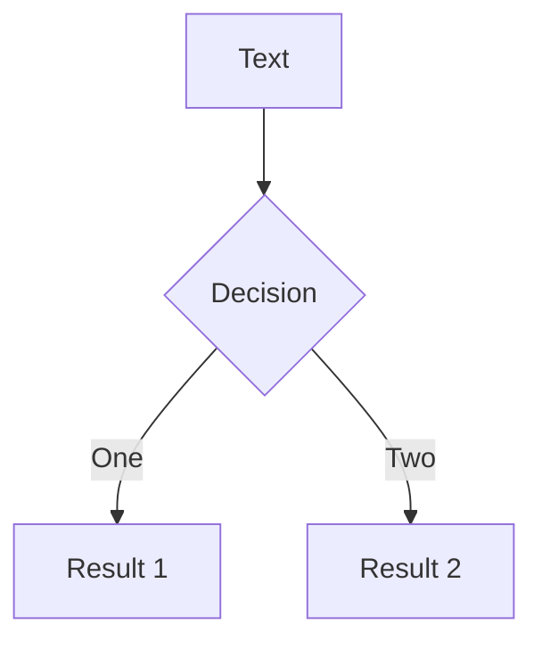
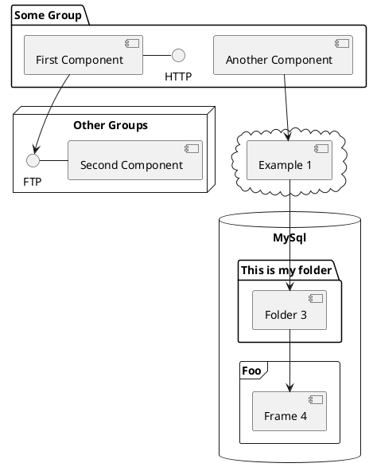

# Time Series Anomaly Detection In ICLR-22

Xiaoshun Yao

Data Mining Lab, UESTC

yaoxs@std.uestc.edu.cn

<!--
The last comment block of each slide will be treated as slide notes. It will be visible and editable in Presenter Mode along with the slide. [Read more in the docs](https://sli.dev/guide/syntax.html#notes)
-->

---

# Background

Unsupervised detection of anomaly points in time series is a challenging problem

### Current paradigms:

- density-estimation
- clustering-based
  - anomaly score formalized as the distance to cluster center
- reconstruction-based
- autoregression-based

<br>

### Drawbacks

* focus on pointwise representation or pairwise association
* insufficient to reason about the intricate dynamics

<!--
You can have `style` tag in markdown to override the style for the current page.
Learn more: https://sli.dev/guide/syntax#embedded-styles
-->

<style>
h1 {
  background-color: #2B90B6;
  background-image: linear-gradient(45deg, #4EC5D4 10%, #146b8c 20%);
  background-size: 100%;
  -webkit-background-clip: text;
  -moz-background-clip: text;
  -webkit-text-fill-color: transparent;
  -moz-text-fill-color: transparent;
}
</style>

---

# Background

Anomalies are rare and hidden by vast normal points

* classic methods: density-estimation, clustering-based
  + ignore temporal information
  + difficult to generalize to unseen real scenarios
* deep models: learning pointwise representations
  + rarity of anomalies: pointwise representation is less informative
  + vast normal time point: less distinguishable
  + pointwise cannot provide a comprehensive description of the temporal context
* explicit association modeling: GNNs, subsequence-based
  + single time point is insufficient for complex temporal patterns
  + cannot capture the fine-grained temporal association between time point and series

<!--
深度模型基于重构误差与自回归预测  
基于子序列到的模型无法捕获细粒度
-->

---

# Question Formalization

* Time series $\mathcal{X}=\{x_1,x_2,\cdots,x_N\}$
* $x_t \in \mathbb{R}^d$ represents the observation of time $t$
* Unsupervised time series anomaly detection
    + whether $x_t$ is anomalous or not without labels

---

# Motivation

Adapt Transformer to time series anomaly detection in the unsupervised regime

* temporal association of each time point can be obtained from the self-attention map
  + describe temporal context and indicate dynamic patterns
* rarity of anomalies and the dominance of normal patterns
  + anomalies is hard to build strong associations with the whole series
  + the adjacent of anomalies shall contains similar abnormal patterns
  + normal time points is highly associate with whole series

<!--
得益于Transformer在全局表征和长距离关联上的统一模型  
-->

---

# Association Discrepancy

utilize the inherent normal-abnormal distinguishability of the association distribution

quantified by Association Discrepancy: the distance between each time point's:

* prior-assocication
* series-association

### Anomaly-Attention

a two-brach self-attention models the prior-association and series-association

* prior-association: learnable Gaussian kernel
* series-association: self-attention weights learned form raw series
* minimax strategy: amplify the normal-abnormal distinguishability

<!--
异常点的关联差异应该更小  
-->

---

# Anomaly Transformer

### Overall Architecture

<!--  -->


<p class="absolute bottom-0 left-3">Anomaly Transformer: Time Series Anomaly Detection with Association Discrepancy, ICLR'22</p>

---

# Anomaly Transformer

### Overall Architechture

stacking structure is conductive to learning underlying association

$L$ layers model and input $\mathcal{X}\in \mathbb{R}^{N\times d}$, for $l$-th layer:

$$
\begin{aligned}
\mathcal{Z}^l&=\text{Layer-Norm}(\text{Anomaly-Attention}(\mathcal{X}^{l-1})+\mathcal{X}^{l-1})  \\
\mathcal{X}^l &= \text{Layer-Norm}(\text{Feed-Forward}(\mathcal{Z}^l)+\mathcal{Z}^l)
\end{aligned}
$$

* $\mathcal{X}^l\in \mathbb{R}^{N\times d_{model}}$, output with $d_{model}$ channels
* $\mathcal{X}^0=\text{Embedding}(\mathcal{X})$
* $\mathcal{Z}^l\in \mathbb{R}^{N\times d_{model}}$ is hidden representation
* $\text{Anomaly-Attention}(\cdot)$ computer association discrepancy

---

# Anomaly-Attention

---

# Components

<div grid="~ cols-2 gap-4">
<div>

You can use Vue components directly inside your slides.

We have provided a few built-in components like `<Tweet/>` and `<Youtube/>` that you can use directly. And adding your custom components is also super easy.

```html
<Counter :count="10" />
```

<!-- ./components/Counter.vue -->
<Counter :count="10" m="t-4" />

Check out [the guides](https://sli.dev/builtin/components.html) for more.

</div>
<div>

```html
<Tweet id="1390115482657726468" />
```

<Tweet id="1390115482657726468" scale="0.65" />

</div>
</div>


---
class: px-20
---

# Themes

Slidev comes with powerful theming support. Themes can provide styles, layouts, components, or even configurations for tools. Switching between themes by just **one edit** in your frontmatter:

<div grid="~ cols-2 gap-2" m="-t-2">

```yaml
---
theme: default
---
```

```yaml
---
theme: seriph
---
```


</div>

Read more about [How to use a theme](https://sli.dev/themes/use.html) and
check out the [Awesome Themes Gallery](https://sli.dev/themes/gallery.html).

---

# LaTeX

LaTeX is supported out-of-box powered by [KaTeX](https://katex.org/).

<br>

Inline $\sqrt{3x-1}+(1+x)^2$

Block
$$
\begin{array}{c}

\nabla \times \vec{\mathbf{B}} -\, \frac1c\, \frac{\partial\vec{\mathbf{E}}}{\partial t} &
= \frac{4\pi}{c}\vec{\mathbf{j}}    \nabla \cdot \vec{\mathbf{E}} & = 4 \pi \rho \\

\nabla \times \vec{\mathbf{E}}\, +\, \frac1c\, \frac{\partial\vec{\mathbf{B}}}{\partial t} & = \vec{\mathbf{0}} \\

\nabla \cdot \vec{\mathbf{B}} & = 0

\end{array}
$$

<br>

[Learn more](https://sli.dev/guide/syntax#latex)

---

# Diagrams

You can create diagrams / graphs from textual descriptions, directly in your Markdown.

<div class="grid grid-cols-3 gap-10 pt-4 -mb-6">







</div>

[Learn More](https://sli.dev/guide/syntax.html#diagrams)


---
layout: center
class: text-center
---

# Thanks!
